# Image Classification - Flower102
***
### 目的:
##### 逢年過節總是會上花市買些鮮花或是植物回家，但是成千上萬種的花卉總是讓人分不清種類名稱，雖然手機app store中已有現成的app可以下載來協助辨別，但自己手動寫一個簡單的分類器也是蠻有趣的，也可以應用到其他不同題目上: 動物分類、植物植株分類、植物葉片分類…等等。這邊簡單介紹一下使用一些簡單的架構來對學術上的 花卉資料集 做分類分析，看看不同模型 backbone 的學習效果。
***
### 資料集 ( DataSet )
* 名稱: Flower102
* 圖片尺寸: 500 x 500 以上
* 花卉種類數量: 102
* 花卉: 蓮花, 向日葵, 玫瑰, 翠菊, 百合, 康乃馨, 虞美人, … 等等
* 圖片數量: 7169 (train) / 1020 (test)
* 來源: https://www.robots.ox.ac.uk/~vgg/data/flowers/102/
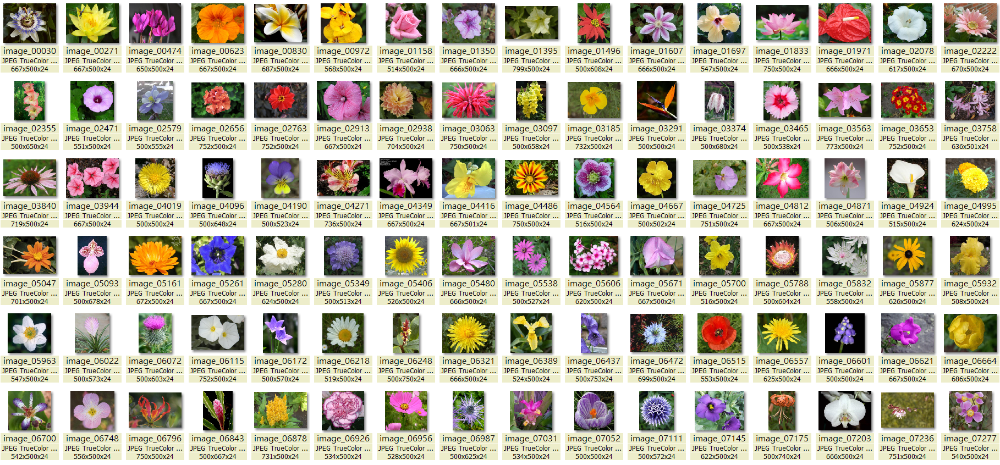
***
### 模型 ( Model Backbones )
* EfficientNet_b0
* ResNet18
* ResNet50
* SE-Resnext50
##### 基於運算資源有限，所以這邊僅以 ResNet 相關模型為主，並輔以一個差不多等級的 EfficientNet_b0 來比較結果。Backbone 後面直接串接一個輸出為102 的線性模組當作分類器，輸出結果再加上softmax()使其102個預測值呈現0~100%之間的機率分布(總合為100%)。
***
### 資料增強 ( Data Augmentation )
##### 為增強資料集的廣泛性與避免訓練 過擬化( over-fit )，訓練上都有隨機加上包括 Transpose, HorizontalFlip, VerticalFlip, ShiftScaleRotate, CoarseDropout, HueSaturationValue 等等變化及正規化 (Normalize)。
***
### 訓練 ( Train, transfer learning)
##### 這邊不使用從零開始( from scratch) 的訓練方式，而是直接載入預先訓練好的 (pretrained) 模型作遷移學習(transfer learning)，站在巨人的肩膀上學習效果會好很多，另外一篇 (Cifar100) 文章我會做兩者的效果比較。  
##### 另外，Flower102 原始圖片尺寸偏大，學術論文的精確度也極高(99%)，故此篇反之故意縮小尺寸來看看大概會有多大的準確度變化。
### Image size: 160x160
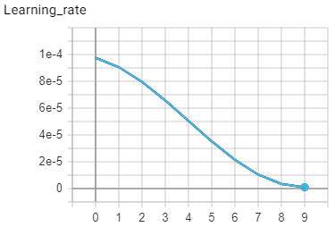
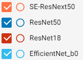
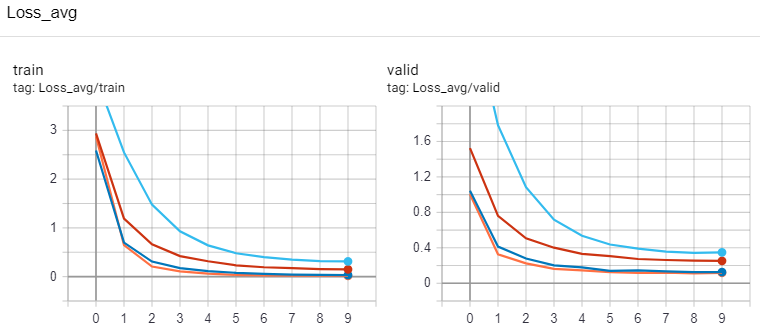
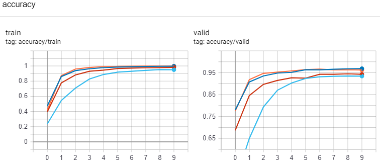
***
### Image size: 320x320

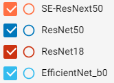
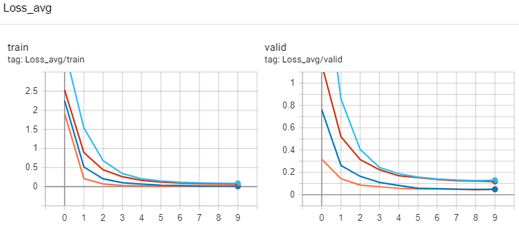
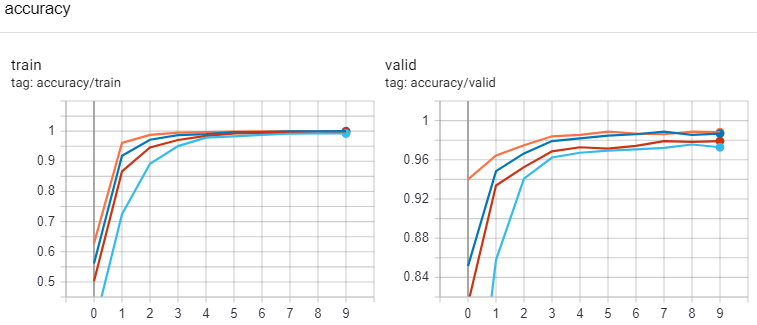
***
### Image size: 640x640
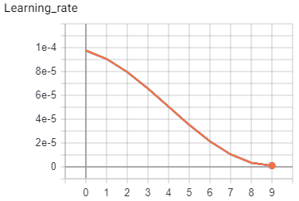
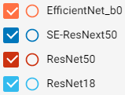
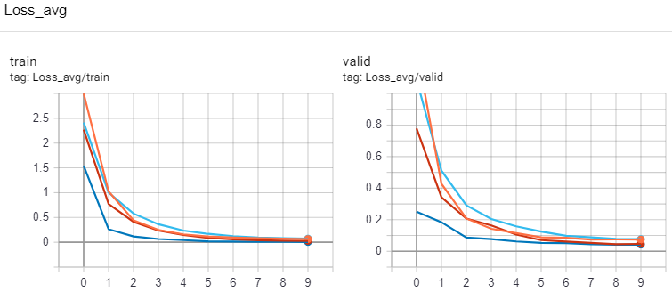
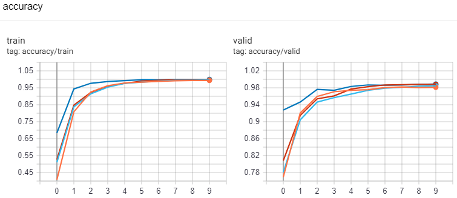  
##### 如果簡單地以 valid loss 來看，訓練過程還沒有 過擬合(over-fit)的問題，精確度在不同圖片尺寸和模型也能達到不錯的訓練結果。
***
### 測試 ( Test )
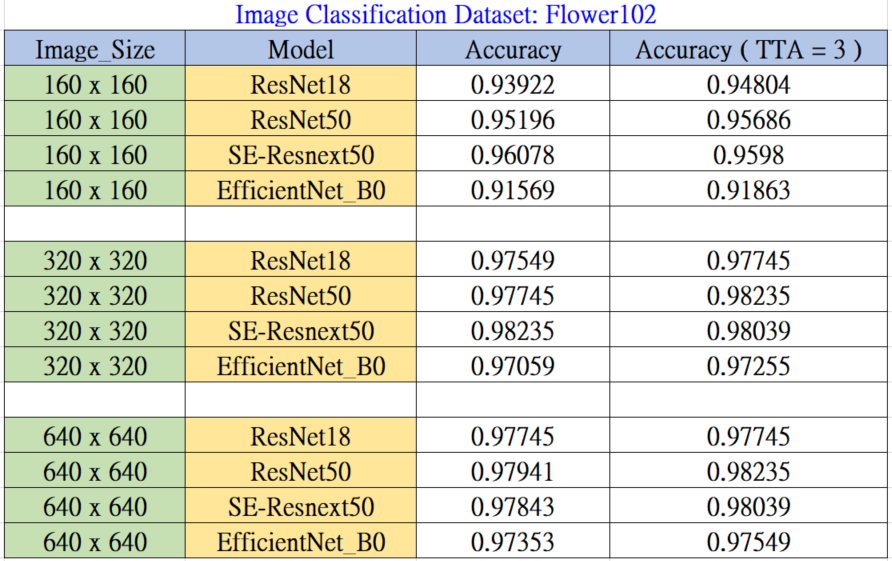  
##### 上面圖表是針對不同圖片尺寸做的測試結果，同樣也施以 TTA ( Test Time Augmentaion ) 看看對結果精確度的影響如何。另外圖片尺寸很大導致運算時間很長，所以就不花更多時間來用 K-Fold 拆分資料訓練來拉高精確度了。  
##### 圖片尺寸 160、320、640 都有不錯的高精確度結果，不過僅僅以 ResNet18來看，當然尺寸 640 的 97% 還是遠勝尺寸 160 的 94%。那以不同模型來看呢，這次的比試反倒是 ResNet50 在尺寸 640 稍占上風 (不過千分之一二的勝利我覺得只是訓練飽和後的小抖動誤差，而且很明顯 SE-ResNext50 在尺寸 320 已經達到飽和了，所以在尺寸 640 沒有辦法再進一步增加)。至於其他尺寸則還是 SE-ResNext50 有著較佳的表現，不過 EfficientNet_b0 效果稍差是有點出乎意料之外了。
##### 如果單以尺寸640來看，其實 ResNet18 其實已經和其他模型誤差相差無幾了，表示以此圖片集來做訓練和判斷，即使小模型也能有著非常優秀的結果，當然大模型的運算時間勢必會增加不少，所以如果圖片能有很高的辨識度，則小模型就足夠殺遍四方了。
#### 歷代學術論文結果:
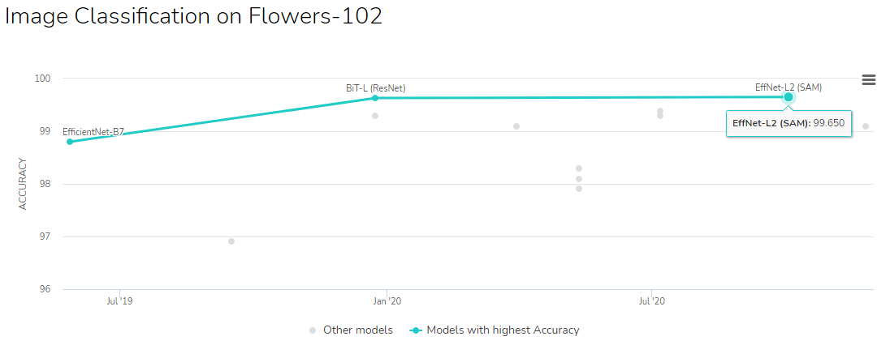  
***
### 結論
##### Flower102 的圖片也是常用的的基準資料集，物件種類102算是蠻多類的，圖片尺寸上也算很大，圖片資料完整但稍微有點資料不平衡的問題(最多為 西番蓮花251張，最少為 垂筒花 /彩鐘花/波麗露花/月見草/波斯菊/雞冠花/蝴蝶蘭等各40張)，不過圖片很清楚而且花形差異算是蠻大的，所以訓練上可以達到非常高的準確度，用來了解分類器模型的訓練趨勢是非常不錯的。
